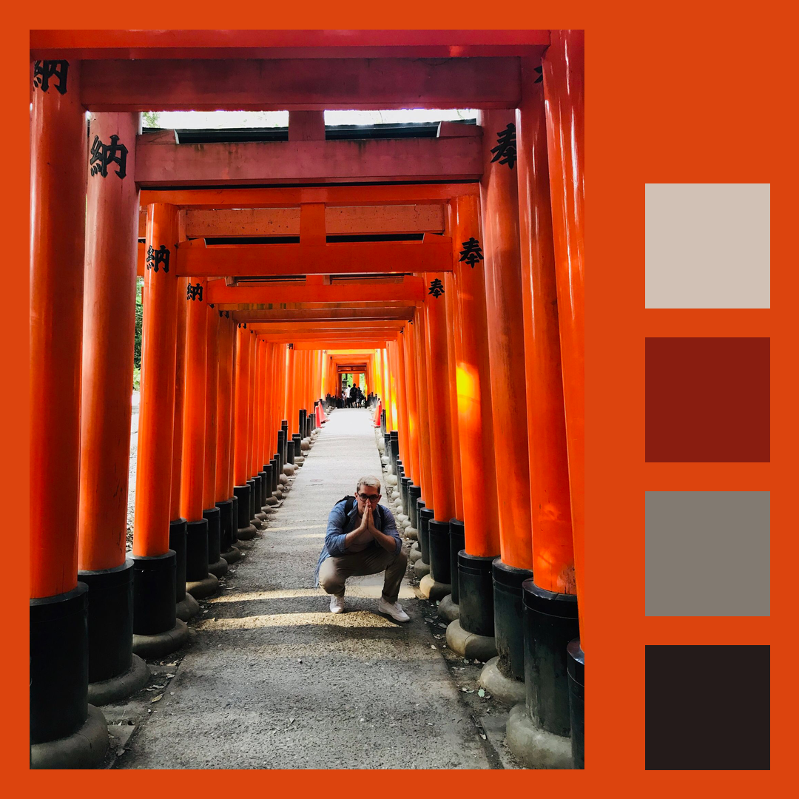

  

# instagram_palette

Based on <https://github.com/jamtyou/instagram_palette>

## Dependencies

- python (built for 3+)
- pip
- modules
  - Pillow
  - sklearn
  - opencv-python
  - numpy

## Using this

1 - Ensure all the above modules are installed

`pip install Pillow sklearn opencv-python numpy`

2 - Add the images you want to convert to the `input` directory

3 - Run the following:

`python insta_palette.py`

4 - Check the `output` directory

# To do

[] Separate out functionality into different files
[] Improve cluster detection - currently missing nice colors
[] Do color counts correspond with colors they're assigned to